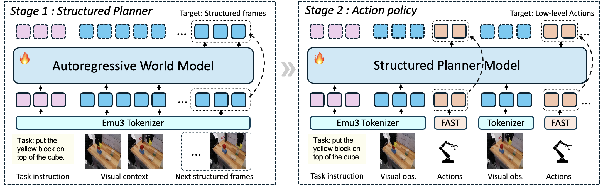

# StructVLA: Beyond Dense Futures as Structured Planning for Robotic Manipulation

StructVLA reformulates generative world models as **structured planners** for robotic manipulation. Instead of predicting dense future rollouts, StructVLA forecasts sparse, physically grounded structured frames derived from robot-centric kinematic cues such as gripper transitions and motion turning points. The resulting structured foresight is then transferred to low-level action generation in a shared discrete token space.



> 📜 [[paper](https://arxiv.org/abs/2603.12553)] 🤖 [[project page](https://wm-planner.github.io/structvla/)] 💻 [[code](https://github.com/wm-planner/structvla)]

## Overview

<div align="center">

<strong>Title</strong>: Beyond Dense Futures: World Models as Structured Planners for Robotic Manipulation

<strong>Authors</strong>: Minghao Jin<sup>1</sup><sup>&#42;</sup>, Mozheng Liao<sup>1</sup><sup>&#42;</sup>, Mingfei Han<sup>1,2</sup><sup>&#42;</sup>, Zhihui Li<sup>1</sup>, Xiaojun Chang<sup>1,2</sup>

<sup>1</sup> University of Science and Technology of China  
<sup>2</sup> Department of CV, MBZUAI  
<sup>*</sup> Equal contribution

</div>

## Abstract

Recent world-model-based Vision-Language-Action architectures improve robotic manipulation by providing predictive visual foresight, but dense future prediction often introduces visual redundancy and accumulates errors over long horizons. Existing sparse alternatives typically rely on semantic subtasks or implicit latent states, which can weaken geometric grounding and reduce alignment between planning and low-level control. StructVLA addresses this by reformulating a generative world model as an explicit structured planner. Instead of predicting dense rollouts, StructVLA forecasts sparse, physically meaningful structured frames derived from robot-centric kinematic cues such as gripper transitions and motion turning points. With a two-stage training paradigm in a shared discrete token space, the model first learns structured foresight and then transfers that capability to action generation. StructVLA achieves strong performance on both simulation and real-world manipulation, including **75.0%** on **SimplerEnv-WidowX** and **94.8%** on **LIBERO**, while also demonstrating robust real-world deployment on both basic pick-and-place and long-horizon tidy-up tasks.

## Highlights

- **Structured world-model planning**: replace dense future rollouts with sparse, physically grounded structured frames.
- **Two-stage training**: pretrain a structured planner first, then fine-tune for action generation.
- **Shared discrete token space**: tightly couples visual planning and executable action prediction.
- **Strong benchmark performance**: validated on **SimplerEnv**, **LIBERO**, and real-world robot deployment.
- **Practical data pipeline**: includes structured-frame extraction, planner training, policy fine-tuning, and evaluation scripts.

## Benchmarks

### LIBERO

| Method | Spatial | Object | Goal | Libero-10 | Average |
|--------|---------|--------|------|-----------|---------|
| StructVLA | **95.4** | **98.0** | **93.4** | **92.2** | **94.8** |

More details: [docs/libero.md](docs/libero.md)

### SimplerEnv-WidowX

| Method | Put Spoon | Put Carrot | Stack Block | Put Eggplant | Average |
|--------|-----------|------------|-------------|--------------|---------|
| StructVLA | **87.5** | **75.0** | **45.8** | 91.7 | **75.0** |

More details: [docs/simpler.md](docs/simpler.md)

### Real-World Manipulation

| Method | Bowl | Box | Toy | Eggplant | Average | Tidy Up (Long-Horizon) |
|--------|------|-----|-----|----------|---------|-------------------------|
| StructVLA | 90.0 | 80.0 | 80.0 | 100.0 | **87.5** | 80.0 |

### Real-World Generalization and Robustness

| Method | Pick&Place (Unseen Objects) | Tidy-Up (Unseen Objects) | Intervention |
|--------|-----------------------------|--------------------------|--------------|
| StructVLA | 80.0 | 70.0 | 80.0 |

## Repository Layout

```text
structvla/
├── configs/          # Model and dataset configuration files
├── datasets/         # Processed dataset metadata and local dataset roots
├── docs/             # Setup, dataset preparation, and benchmark guides
├── documents/        # Structured-frame outputs and experiment artifacts
├── experiments/      # Project page and experiment notes
├── logs/             # Training checkpoints and local run outputs
├── models/           # Inference wrappers, tokenizer, and policy heads
├── pretrain/         # Base pretrained model assets and tokenizer assets
├── reference/        # External reference code (Emu3, RoboVLMs, LIBERO, SimplerEnv)
├── scripts/          # Training and evaluation shell scripts
├── tools/            # Data processing, keystep extraction, and real-world tools
├── train/            # Core training entry points and dataset classes
└── README.md
```

## Setup

A minimal environment setup is:

```bash
conda create -n structvla python=3.10
conda activate structvla
pip install -r requirements.txt
```

For benchmark-specific environment setup, see:

- [docs/libero.md](docs/libero.md)
- [docs/simpler.md](docs/simpler.md)
- [docs/real-world.md](docs/real-world.md)

## Pretrained Checkpoints

Required pretrained resources:

- [Emu3-Base](https://huggingface.co/BAAI/Emu3-Stage1)
- [Emu3-VisionVQ / Emu3-VisionTokenizer](https://huggingface.co/BAAI/Emu3-VisionTokenizer)
- [WORLD_MODEL_POSTTRAIN](https://huggingface.co/Yuqi1997/UniVLA/tree/main/WORLD_MODEL_POSTTRAIN)

Note:
- `Emu3-VisionVQ` and `Emu3-VisionTokenizer` refer to the same vision tokenizer resource.
- The naming difference comes from modifications in the original baseline project.
- See [pretrain/README.md](pretrain/README.md) for the expected local layout.

## Data Preparation

### LIBERO

```bash
# process dataset
python tools/process/libero_process.py

# extract VQ tokens
bash scripts/tokenizer/extract_vq_emu3.sh

# generate training pickle
python tools/pickle_gen/pickle_generation_libero.py   --dataset_path ./datasets/processed_data   --output_path ./datasets/processed_data/meta   --normalizer_path ./configs/normalizer_libero   --output_filename libero_all_norm.pkl

# extract structured frames
python tools/structured_frames/structured_frames_extract.py   --datasets libero   --dataset /path/to/libero.pkl   --out_dir /path/to/output
```

### SimplerEnv / Bridge

```bash
# process bridge dataset
python tools/process/simplerenv_bridge.py   --dataset_dir /path/to/bridge_orig/1.0.0   --output_dir /path/to/save/processed_data/bridge

# extract VQ tokens
bash scripts/tokenizer/extract_vq_emu3.sh

# generate training pickle
python tools/pickle_gen/pickle_generation_simplerenv_bridge.py

# extract structured frames
python tools/structured_frames/structured_frames_extract.py   --datasets simpler   --dataset /path/to/bridge.pkl   --out_dir /path/to/output
```

### Real-World Teleoperation Data

```bash
# example preprocessing pipeline
python tools/real_world/teledata_process.py

# extract structured frames
python tools/structured_frames/structured_frames_extract.py   --datasets real   --dataset /remote-home/share/real-data/meta/real_all_norm.pkl   --out_dir /remote-home/structvla/documents/keysteps_real_dataset
# or use the specialized script for clean data
python tools/structured_frames/extract_real_robot.py   --dataset /remote-home/share/real-data/meta/real_all_norm.pkl   --out_dir /remote-home/structvla/documents/extract_real_robot
```

## Structured Frames Extraction

The repository includes a unified keystep extraction pipeline that reproduces the current canonical `simpler` and `libero` structured-frame CSV results while remaining extensible to other datasets.

We also provide a lightweight VLM-based filtering step to further refine the extracted structured frames when additional reliability is desired. This stage is not required for the standard pipeline, but can be used as a post-processing step on the generated keystep CSV files.

See:
- [tools/structured_frames/README.md](tools/structured_frames/README.md)


## Training

### 1. Structured planner training

```bash
# SimplerEnv planner
bash scripts/planner/train_video_1node_simpler.sh

# LIBERO planner
bash scripts/planner/train_video_1node_libero.sh

# Real-world planner
bash scripts/planner/train_video_1node_robot.sh
```

- SimplerEnv planner Hugging Face ckpt: [PLANNER_BRIDGE_30K](https://huggingface.co/Minham/StructVLA/tree/main/PLANNER_BRIDGE_30K)
- LIBERO planner Hugging Face ckpt: [PLANNER_LIBERO_10K](https://huggingface.co/Minham/StructVLA/tree/main/PLANNER_LIBERO_10K)

### 2. Action policy training

```bash
# SimplerEnv policy
bash scripts/simulator/simplerenv/train_simplerenv_bridge_video.sh

# LIBERO policy
bash scripts/simulator/libero/train_libero_video.sh

# Real-world policy
bash scripts/real_world/train_real_world_robot.sh
```

- SimplerEnv policy Hugging Face ckpt: [STRUCTVLA_BRIDGE_20K](https://huggingface.co/Minham/StructVLA/tree/main/STRUCTVLA_BRIDGE_20K)
- LIBERO policy Hugging Face ckpt: [STRUCTVLA_LIBERO_4K](https://huggingface.co/Minham/StructVLA/tree/main/STRUCTVLA_LIBERO_4K)

## Evaluation

### LIBERO

```bash
cd reference/RoboVLMs
bash scripts/libero/run_eval_libero_structvla_${TASK_SUITE}.sh ${CKPT_PATH}
```

### SimplerEnv

```bash
cd reference/RoboVLMs
bash scripts/simpler/bridge_structvla.sh ${CKPT_PATH}
```

### Real-World Deployment

```bash
python tools/real_world/real_experiments_server.py
```


## Notes

- Some benchmark-specific quantitative details are still being cleaned up for public release.
- If a table entry, model link, or experiment identifier is still missing, it can be filled in later without changing the repository structure.
- The current repository preserves both training scripts and reference evaluation code paths used in our experiments.

## Acknowledgement

This project builds upon several excellent open-source efforts:

- [UniVLA](https://github.com/baaivision/UniVLA)
- [Emu3](https://github.com/baaivision/Emu3)
- [RoboVLMs](https://github.com/Robot-VLAs/RoboVLMs)
- [SimplerEnv](https://github.com/simpler-env/SimplerEnv)
- [LIBERO](https://github.com/Lifelong-Robot-Learning/LIBERO)


## Citation

If you find our work helpful, please cite:

```bibtex
@article{jin2026structvla,
  title={Beyond Dense Futures: World Models as Structured Planners for Robotic Manipulation},
  author={Jin, Minghao and Liao, Mozheng and Han, Mingfei and Li, Zhihui and Chang, Xiaojun},
  journal={arXiv preprint arXiv:2603.12553},
  year={2026}
}
```
