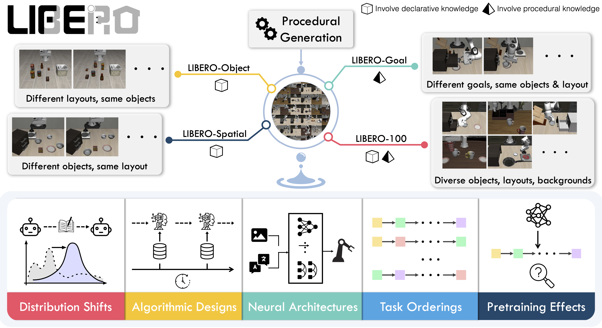

# LIBERO Benchmark

[LIBERO](https://github.com/Lifelong-Robot-Learning/LIBERO) is a benchmark for studying knowledge transfer in multitask and lifelong robot learning problems. 



## Environment Setup
```shell
apt-get install libgl1-mesa-dri

cd reference/RoboVLMs

bash scripts/setup_libero.sh
```

Dataset download from [huggingface](https://huggingface.co/datasets/openvla/modified_libero_rlds).

## Dataset Preparation
```shell
# 1. process the dataset, we process all the LIBERO suites together
python tools/process/libero_process.py

# 2. extract the vq tokens, need to change the dataset & output path, without augmentation
bash scripts/tokenizer/extract_vq_emu3.sh 

# 3. pickle generation for training
python tools/pickle_gen/pickle_generation_libero.py\
  --dataset_path ./datasets/processed_data \
  --output_path ./datasets/processed_data/meta \
  --normalizer_path ./configs/normalizer_libero \
  --output_filename libero_all_norm.pkl

# 4. structured frames generation
python tools/structured_frames/structured_frames_extract.py   --datasets libero   --dataset /path/to/your.pkl   --out_dir /path/to/output

```


## Model Training
```shell
# 1. structured planner training
bash scripts/planner/train_video_1node_libero.sh

# 2. action policy training
bash scripts/simulator/libero/train_libero_video.sh
```

## Model Evaluation
```shell
cd reference/RoboVLMs

# 1 GPU inference, modify the {task_suite_name} for different tasks
bash scripts/libero/run_eval_libero_structvla_${task_suite_name}.sh ${CKPT_PATH} 

```
