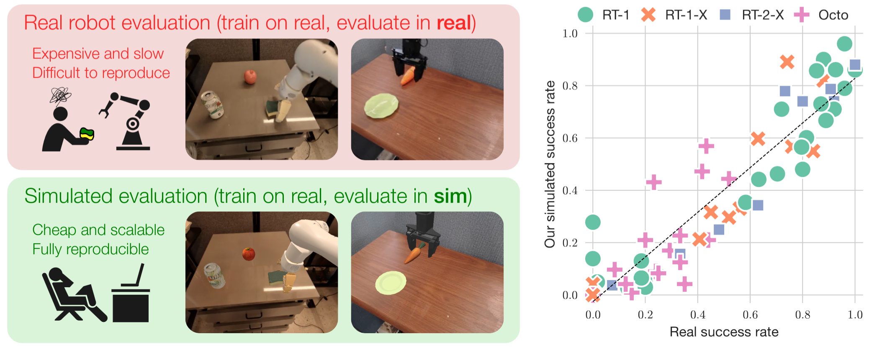

# SIMPLERENV Benchmark

[SIMPLERENV](https://github.com/simpler-env/SimplerEnv) is a benchmark for real-to-sim robot evaluation. 



## Environment Setup
We follow the [RoboVLMs](https://github.com/Robot-VLAs/RoboVLMs) repository for environment setup. This setup is only for evaluation. The following steps are required to set up the environment:

> Note: when use ray-tracing rendering, please make sure you have the nvoptix.so in /usr/share/nvidia

```shell
# Install dependencies
cd reference/RoboVLMs

# This will install the required environment
bash scripts/setup_simplerenv.sh

# Only for rendering environment.
bash scripts/setup_simplerenv_vla.sh

# Check if the environment is set up correctly
python eval/simplerenv/env_test.py
```

## Dataset Preparation
```shell
# 1. process the dataset (bridge & google)
python tools/process/simplerenv_bridge.py
    --dataset_dir /path/to/bridge_orig/1.0.0 \
    --output_dir /path/to/save/processed_data/bridge

# 2. extract the vq tokens, need to change the dataset & output path
bash scripts/tokenizer/extract_vq_emu3.sh

# 3. pickle generation for training
python tools/pickle_gen/pickle_generation_simplerenv_bridge.py

# 4. structured frames generation
python tools/structured_frames/structured_frames_extract.py   --datasets simpler   --dataset /path/to/your.pkl   --out_dir /path/to/output
```

## Model Training

### FAST Tokenizer
[optional] You can fit the FAST tokenizer on the corresponding dataset. Also, you can adjust the scale in tokenizer for more fine-grained tokenization.
```shell
python tools/action_tokenizer/fit_fast.py


# 1. structured planner training
bash scripts/planner/train_video_1node_simpler.sh

# 2. action policy training
bash scripts/simulator/simplerenv/train_simplerenv_bridge_video.sh
#

```

## Model Evaluation
```shell
cd reference/RoboVLMs

bash scripts/simpler/bridge_structvla.sh ${CKPT_PATH}

```
